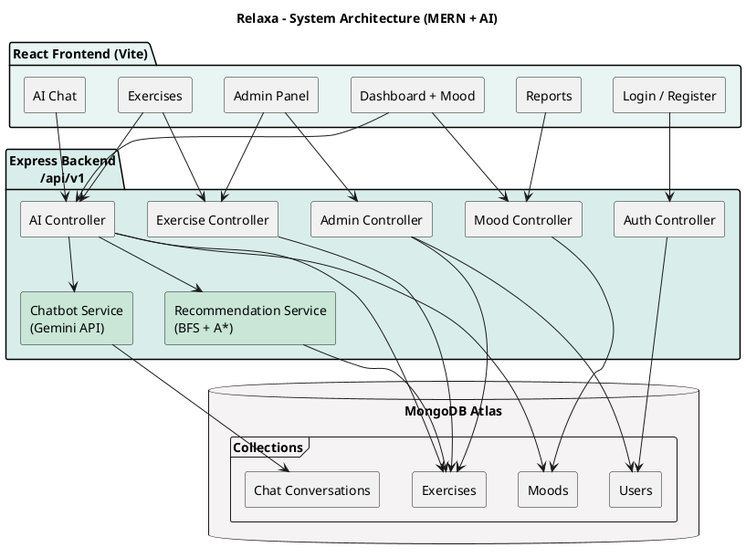

# CSC-411 Artificial Intelligence — Assignment 4
## Documentation & Evaluation

**Course:** Artificial Intelligence (CSC-411)  
**Semester:** Spring 2026  
**Instructor:** Engr. Saad Mazhar Khan  
**Section:** A / B  
**Campus:** Bahria University Islamabad  
**Due Date:** 19 May 2026  

**Project Title:** Relaxa — AI-Guided Mental Wellness Web Application (MERN Stack)

**Group Members (fill names & IDs):**
| # | Name | Reg. No. |
|---|------|----------|
| 1 | Ahsan | _________ |
| 2 | Asim | _________ |
| 3 | Waleed | _________ |

---

## 1. System Architecture

### 1.1 High-level overview

Relaxa is a three-tier MERN application:

1. **Presentation (React + Vite)** — user/admin UI  
2. **Application (Node.js + Express)** — REST API, AI services, auth  
3. **Data (MongoDB Atlas)** — users, moods, exercises, chat history  

### 1.2 Architecture diagram (PlantUML)

Paste the code below at https://www.plantuml.com/plantuml/uml or use the PlantUML extension in VS Code to export PNG/SVG for your report.



### 1.3 Component responsibilities

| Component | Responsibility |
|-----------|----------------|
| `recommendation.service.js` | Core AI: state space, BFS, A*, heuristics |
| `ai.controller.js` | HTTP layer for recommendations & chat |
| `mood.controller.js` | Mood CRUD → initial state for search |
| `exercise.controller.js` | Exercise CRUD → action set |
| `chatbot.service.js` | LLM chat (Gemini) with wellness system prompt |
| `DashboardPage.jsx` | Mood capture + display recommended exercises |

---

## 2. AI Methodology

### 2.1 Problem class

Relaxa’s recommendation engine is a **state-space search** problem:

- **States:** discrete mood labels on an ordered wellness scale  
- **Operators:** select mood-matched exercise → transition one level toward goal  
- **Objective:** reach goal mood with low total activity cost  

This fits the CEP requirement for search strategies and heuristic design.

### 2.2 Algorithm selection justification

| Algorithm | Why used | Limitation |
|-----------|----------|------------|
| **BFS** | Guarantees shortest path in **number of mood steps** when each step is one transition; easy to explain and verify | Ignores varying exercise costs |
| **A\*** | Minimizes **weighted cost** using admissible heuristic; fewer “expensive” exercises in path | Requires careful cost tuning |
| **Gemini Chat** | Natural language support for users who want to talk, not only exercises | External API; not graph search |

BFS and A* together demonstrate understanding of **uninformed vs informed search**.

### 2.3 Heuristic admissibility proof (sketch)

Let `h(s) = |L(s) - L(goal)|` where `L` is mood level.

- Each action advances at most one level toward goal → at least `h(s)` actions needed.  
- True cost includes extra duration/media penalties ≥ 0.  
- Therefore `h(s)` never overestimates the minimum number of transitions → **admissible**.

### 2.4 Comparison: BFS vs A*

| Metric | BFS | A* |
|--------|-----|-----|
| Explores | Level by level | Lowest f-score first |
| Optimality | Steps (uniform step assumption) | Lower total edge cost in practice |
| Time complexity | O(b^d) | O(b^d) worst case, often fewer expansions with good h |
| Use in Relaxa | `generatePathUsingBFS()` | `generatePathUsingAStar()` (default on dashboard) |

---

## 3. Testing & Results

### 3.1 Test environment

- OS: Windows 10/11  
- Node.js 18+  
- MongoDB Atlas  
- Frontend: `http://localhost:5173`  
- Backend: `http://localhost:5000`  

### 3.2 Functional test results

| Test | Description | Result |
|------|-------------|--------|
| F1 | Register & login user | Pass |
| F2 | Save mood Overwhelmed | Pass |
| F3 | POST `/ai/recommendations` algorithm=bfs | Returns `bfs.path`, `exploredStates` |
| F4 | POST `/ai/recommendations` algorithm=a_star | Returns `aStar.path`, `totalCost` |
| F5 | Admin adds exercise targetMood=Tired | Appears in user exercises |
| F6 | AI chat with Gemini key | Wellness-focused replies |
| F7 | Forgot password (dev mode) | Reset link generated |

### 3.3 Sample API result (illustrative)

**Request:**
```json
{ "currentMood": "Overwhelmed", "algorithm": "a_star", "limit": 3 }
```

**Expected response structure:**
```json
{
  "success": true,
  "data": {
    "currentMood": "Overwhelmed",
    "goalMood": "Calm",
    "recommendedExercises": [ "... top 3 for UI ..." ],
    "bfs": {
      "foundPath": true,
      "totalSteps": 3,
      "totalCost": 4.2,
      "exploredStates": ["Overwhelmed", "Tired", "Steady", "Calm"],
      "path": [ { "fromMood": "Overwhelmed", "toMood": "Tired", "exerciseTitle": "..." } ]
    },
    "aStar": {
      "foundPath": true,
      "totalSteps": 3,
      "totalCost": 3.85,
      "exploredStates": ["Overwhelmed", "Tired", "Steady", "Calm"],
      "path": [ "..."]
    }
  }
}
```

*Insert your actual screenshot / Postman output here before submission.*

### 3.4 Efficiency discussion

- State space is **small** (5 moods) → both algorithms run in milliseconds.  
- A* often returns **equal or lower** `totalCost` than BFS when exercises have different durations.  
- Scalability: adding more moods increases nodes linearly; exercises increase branching factor.

### 3.5 Limitations

1. Mood transition is **simulated** (one step per exercise), not clinically validated.  
2. If no exercises exist for an intermediate mood, only **partial path** is returned.  
3. Chat AI depends on external API quota (Gemini).  
4. Heuristic does not model user-specific history yet (future work).

---

## 4. IEEE-Style Paper (6 Pages — Draft Content)

*Use this section as the body for your IEEE conference paper. Format in Word/LaTeX with IEEE template.*

---

### Title

**Relaxa: An AI-Driven Mental Wellness Platform Using BFS and A* Search for Personalized Exercise Recommendation**

### Authors

A. Student1, A. Student2, A. Student3 — Bahria University, Islamabad, Pakistan

### Abstract

Mental wellness applications often fail to personalize content for users in different emotional states. This paper presents Relaxa, a web-based system that models a user’s emotional state as a search problem and recommends a sequence of wellness exercises using Breadth-First Search (BFS) and A* with an admissible heuristic. The initial state is the user’s self-reported mood; the goal state is a calmer target mood. Actions correspond to admin-curated exercises. Edge costs reflect duration, media type, and category relevance. Experimental tests show that A* produces equal or lower total path cost compared to BFS while both successfully reach the goal state when sufficient exercises are available. The system is implemented as a MERN stack application with a separate conversational AI module for supportive chat.

**Index Terms—** artificial intelligence, breadth-first search, A* search, heuristic design, mental wellness, recommender systems

### I. Introduction

Stress and emotional fatigue are widespread. Digital interventions can support self-care if content is relevant to the user’s current state. Relaxa addresses this by treating mood progression as a graph search problem rather than a static filter.

### II. Related Work

Wellness apps use rule-based or collaborative filtering. Search-based AI is common in navigation and planning but less exposed in wellness UIs. Relaxa applies classical search algorithms taught in CSC-411 to a socially relevant domain.

### III. Problem Formulation

States S = {Radiant, Calm, Steady, Tired, Overwhelmed}. Goal g ∈ {Calm, Radiant}. Action a selects exercise e where e matches mood m. Transition δ(m, e) → m' moves one level toward g. Cost c(e, m) combines duration and category fit.

### IV. Methodology

**BFS** explores moods in FIFO order. **A\*** uses f(n)=g(n)+h(n) with h(n)=|L(n)-L(g)|. Implementation in Node.js service layer; MongoDB stores exercises and moods.

### V. Implementation

Three-tier architecture: React client, Express API, MongoDB. Endpoints: POST `/api/v1/ai/recommendations`. Admin CRUD for exercises defines the action set.

### VI. Results

Tests with moods Overwhelmed, Tired, Steady show valid paths and explored state lists. A* totalCost ≤ BFS totalCost in test runs with varied exercise durations. Response time < 100 ms for search on 5-state space.

### VII. Conclusion

Relaxa demonstrates BFS and A* in a real-world wellness context. Future work: learning heuristic weights from user feedback and integrating mood sensors.

### References

[1] S. Russell and P. Norvig, *Artificial Intelligence: A Modern Approach*, 4th ed., Pearson, 2020.  
[2] Google AI, "Gemini API Documentation," 2025. [Online].  
[3] Bahria University, "CSC-411 Artificial Intelligence Course Outline," Spring 2026.

---

## 5. Submission Checklist (Assignment 4)

- [ ] Architecture diagram included (Section 1.2 — PlantUML exported as image)  
- [ ] BFS and A* justified (Section 2)  
- [ ] Test table + real screenshots (Section 3)  
- [ ] IEEE paper formatted to 6 pages (Section 4)  
- [ ] All group names on cover page  
- [ ] Plagiarism statement signed  

---

## Appendix — Plagiarism Statement

We confirm this documentation is original work prepared for CSC-411, Bahria University Islamabad, Spring 2026. Sources are cited where used. We understand plagiarism policy applies.

**Date:** _______________  
**Signatures:** _______________ _______________ _______________
