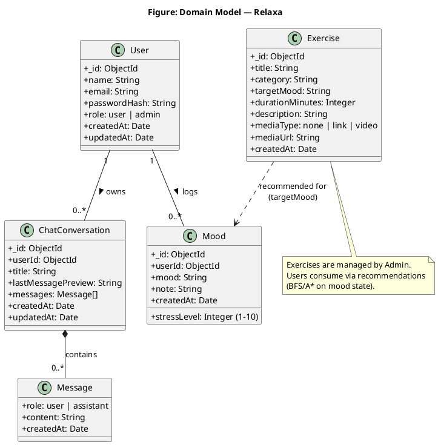
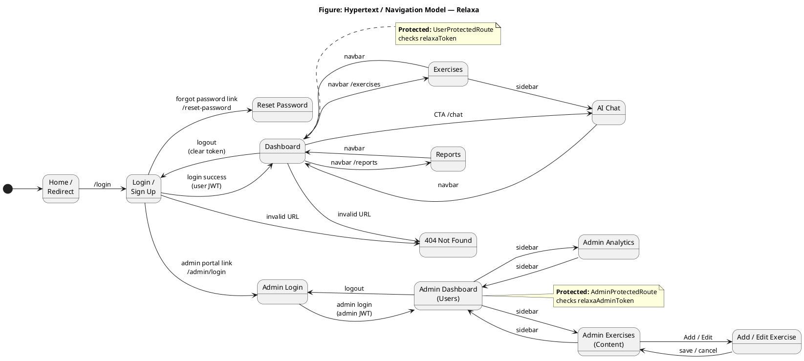
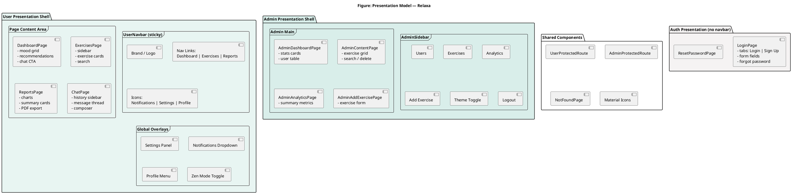

# Assignment 4 — Project Design Report Content (Relaxa)
## CLO-1 & CLO-2 — Models, Framework, Responsive Design, Testing

**Note:** System architecture & three-tier diagrams are in `docs/Relaxa_Architecture_PlantUML.md`.  
Paste PlantUML at: https://www.plantuml.com/plantuml/uml

---

## a.i — Domain Model

### Explanation (for report)

The domain model represents the **core business entities** of Relaxa and how they relate. A **User** can log many **Mood** entries and hold many **ChatConversation** sessions. **Exercise** content is created by admins and recommended to users based on mood. Relationships use one-to-many cardinality.

### PlantUML — Domain Model

---

## a.ii — Hypertext / Navigation Model

### Explanation (for report)

Relaxa is a **Single Page Application (SPA)**. Navigation uses **React Router** — URLs change without full page reload. Public routes (login) are separate from **protected user routes** (JWT required) and **protected admin routes**. The diagram shows pages as nodes and links as transitions.

### PlantUML — Navigation Model

### Navigation table (optional in report)

| Page | URL | Access |
|------|-----|--------|
| Login / Register | `/login` | Public |
| Reset Password | `/reset-password` | Public (token in URL) |
| Dashboard | `/dashboard` | User (JWT) |
| Exercises | `/exercises` | User (JWT) |
| Reports | `/reports` | User (JWT) |
| AI Chat | `/chat` | User (JWT) |
| Admin Login | `/admin/login` | Public |
| User Management | `/admin/dashboard` | Admin (JWT) |
| Exercise Library | `/admin/content` | Admin (JWT) |
| Analytics | `/admin/analytics` | Admin (JWT) |
| Add Exercise | `/admin/exercises/new` | Admin (JWT) |
| Edit Exercise | `/admin/exercises/:id/edit` | Admin (JWT) |

---

## a.iii — Presentation Model

### Explanation (for report)

The presentation model describes **UI structure**: global layout (navbar, sidebar), main content areas, and reusable components. Relaxa has two presentation shells: **User shell** (UserNavbar + page content) and **Admin shell** (AdminSidebar + admin main area).

### PlantUML — Presentation Model

### Presentation components table

| Component | Used on | Purpose |
|-----------|---------|---------|
| `UserNavbar` | All user pages | Navigation, settings, notifications, profile |
| `AdminSidebar` | All admin pages | Admin menu and logout |
| `UserProtectedRoute` | Dashboard, Exercises, Reports, Chat | Block access without login |
| `AdminProtectedRoute` | Admin pages | Block access without admin login |
| Mood cards | Dashboard | Capture current mood |
| Chat history sidebar | Chat | List saved conversations |
| Exercise form grid | Admin | Create/update exercises |

---

## b.ii — Framework for the application (detailed explanation)

### Selected framework: **MERN Stack**

| Layer | Technology | Role in Relaxa |
|--------|------------|----------------|
| **MongoDB** | Database | Stores users, moods, exercises, chat history |
| **Express.js** | Backend framework | REST API at `/api/v1`, middleware, controllers |
| **React** | Frontend library | Interactive UI components and state |
| **Node.js** | Runtime | Runs the Express server |

### Supporting tools

| Tool | Purpose in Relaxa |
|------|-------------------|
| **Vite** | Fast development server and production build for React |
| **React Router v7** | Client-side routing (`/dashboard`, `/admin/...`) |
| **Mongoose** | MongoDB schemas and validation |
| **JWT (jsonwebtoken)** | Secure login sessions for users and admins |
| **bcryptjs** | Password hashing |
| **Google Gemini API** | AI psychologist chat responses |
| **jsPDF** | Client-side PDF export on Reports page |
| **Selenium + pytest** | Automated UI testing (Assignment 3) |

### Why MERN fits Relaxa (paragraph for report)

Relaxa was implemented using the **MERN stack** because it provides a complete JavaScript-based full-stack solution suitable for a modern wellness web application. **MongoDB** stores flexible documents for mood logs, exercise metadata, and nested chat messages without complex relational joins. **Express.js** exposes a clear REST API (`/api/v1`) that separates authentication, mood tracking, exercise management, AI recommendations (BFS/A*), and admin operations. **React** enables a responsive SPA with reusable components such as `UserNavbar`, mood cards, chat interface, and admin CRUD forms. **Node.js** unifies the backend runtime with the same language used on the frontend, which improves team productivity. Additional tools such as **Vite** accelerate development, **JWT** secures protected routes, and **Gemini API** powers conversational AI features beyond traditional CRUD.

---

## c — Responsive Design

### Approach in Relaxa

Relaxa uses **CSS media queries** and **flexible layouts** (flexbox, grid, `%` widths) so pages adapt to mobile, tablet, and desktop. There is no separate mobile app; one React codebase serves all screen sizes.

### Breakpoints used in project

| Breakpoint | File / area | Behavior |
|------------|-------------|----------|
| `max-width: 767px` | ChatPage | Mobile chat layout; sidebar hidden |
| `min-width: 768px` | ChatPage | Show chat history sidebar |
| `max-width: 800px` | UserNavbar | Reduced padding, compact nav links |
| `max-width: 860px` | LoginPage | Stack login layout for small screens |
| `min-width: 900px` | LoginPage, Dashboard | Wider layout, side content |
| `max-width: 900px` | Dashboard, Admin | Single-column grids |
| `min-width: 1024px` | Exercises, Reports | Multi-column grids |

### Screenshots to add in report (required)

Take **3–4 screenshots** of the **same page** at different browser widths:

1. **Login page** — Desktop (1920px), Tablet (768px), Mobile (375px)  
2. **Dashboard** — Desktop + Mobile (mood grid stacks vertically)  
3. **Chat page** — Desktop (sidebar visible) vs Mobile (full-width chat)  
4. **Admin Exercise page** — Desktop + narrow width (optional)

**How to capture:**
1. Open Relaxa in Chrome  
2. Press `F12` → Toggle device toolbar (`Ctrl+Shift+M`)  
3. Select iPhone / iPad / Responsive  
4. Screenshot each (`Win + Shift + S`)

### Report caption example

> **Figure X:** Responsive design of Relaxa Dashboard at (a) desktop 1440px, (b) tablet 768px, and (c) mobile 375px. Layout adjusts using CSS media queries; mood cards reflow from multi-column to single column on smaller screens.

---

## d — Testing (test cases for final report)

Include **manual test cases** and reference **Selenium automated tests** from `tests/selenium/`.

### Table 1 — Functional test cases (manual)

| TC ID | Module | Test case | Steps | Expected result | Pass/Fail |
|-------|--------|-----------|-------|-----------------|-----------|
| TC-01 | Auth | User registration | 1. Open `/login` 2. Sign Up tab 3. Enter name, email, password 4. Submit | Account created; redirect to dashboard | |
| TC-02 | Auth | User login | 1. Login tab 2. Valid credentials 3. Submit | JWT stored; dashboard loads | |
| TC-03 | Auth | Invalid login | 1. Wrong password 2. Submit | Error message shown; stay on login | |
| TC-04 | Mood | Log mood | 1. Dashboard 2. Click mood (e.g. Calm) 3. Wait | Mood saved; recommendations appear | |
| TC-05 | Exercises | View exercises | 1. Log mood 2. Go to Exercises | Exercises matching mood displayed | |
| TC-06 | Reports | View mood trends | 1. Go to Reports | Charts/summary load from API | |
| TC-07 | AI Chat | Send message | 1. Open Chat 2. Type message 3. Send | AI reply appears; conversation saved | |
| TC-08 | Admin | Admin login | 1. `/admin/login` 2. Admin credentials | Admin dashboard loads | |
| TC-09 | Admin | Create exercise | 1. Add Exercise 2. Fill form 3. Create | Success message; in library | |
| TC-10 | Admin | Delete exercise | 1. Content page 2. Delete 3. Confirm | Exercise removed from list | |

### Table 2 — CRUD test cases (Selenium — Admin Exercise)

| TC ID | Operation | Automated test | Expected |
|-------|-----------|----------------|----------|
| CRUD-C-01 | Create | `test_crud_exercise_full_flow` | Exercise created |
| CRUD-R-01 | Read | Search in library | Exercise visible |
| CRUD-U-01 | Update | Edit title | Updated title shown |
| CRUD-D-01 | Delete | Delete + confirm | Exercise removed |

### Table 3 — Smoke test cases (Selenium)

| TC ID | Test name | Description |
|-------|-----------|-------------|
| SMK-01 | `test_user_login_and_navigation` | User login; navbar to Exercises, Reports, Dashboard |
| SMK-02 | `test_user_pages_direct_access` | Direct URL access after login |
| SMK-03 | `test_admin_login_dashboard` | Admin login; User Management visible |

### Table 4 — Responsive test cases

| TC ID | Page | Screen size | Expected |
|-------|------|-------------|----------|
| RES-01 | Login | 375px | Form readable; no horizontal scroll |
| RES-02 | Dashboard | 375px | Mood cards stack vertically |
| RES-03 | Chat | 375px | Chat usable; sidebar hidden |
| RES-04 | Chat | 1024px+ | History sidebar visible |
| RES-05 | Admin | 768px | Sidebar + content usable |

### Testing conclusion (sample paragraph)

Testing of Relaxa included **manual functional testing** for authentication, mood logging, exercises, reports, and AI chat, plus **automated Selenium tests** for admin exercise CRUD and navigation smoke tests. All critical CRUD operations passed using `test_crud_exercises.py`. Responsive behavior was verified at 375px, 768px, and 1440px widths. Limitations: AI chat depends on valid Gemini API key; email features require SMTP/Resend in production.

---

## Report section checklist

- [ ] Domain Model diagram (PlantUML → PNG)
- [ ] Navigation Model diagram (PlantUML → PNG)
- [ ] Presentation Model diagram (PlantUML → PNG)
- [ ] Framework explanation (MERN — section b.ii)
- [ ] Architecture diagrams (separate file — already done)
- [ ] Responsive screenshots (3–4 pages, multiple widths)
- [ ] Test case tables (manual + Selenium + responsive)
- [ ] Group names on cover page
