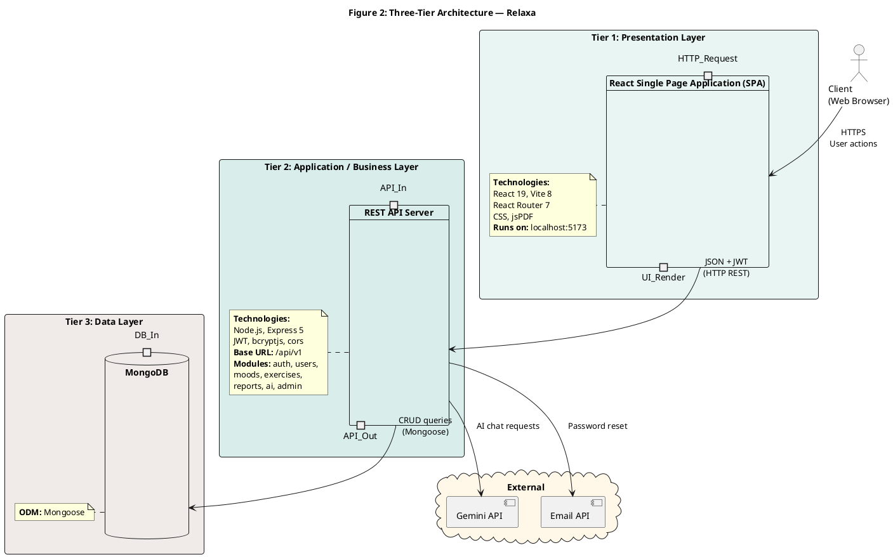
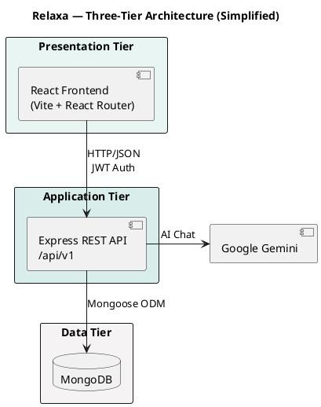
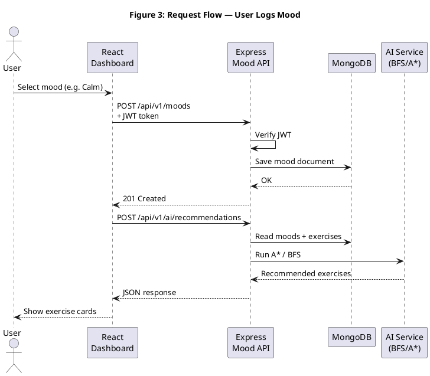
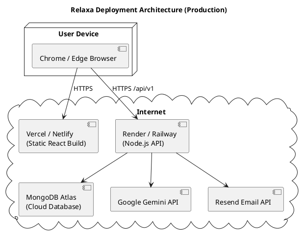

# Relaxa — PlantUML Architecture Diagrams

**How to export:** Paste each block at [https://www.plantuml.com/plantuml/uml](https://www.plantuml.com/plantuml/uml) → Export PNG/SVG for your report.

---

## Diagram 1 — System Architecture (MERN + Modules)

Use as **Figure 1: System Architecture of Relaxa**

```plantuml
@startuml Relaxa_System_Architecture
title Figure 1: Relaxa System Architecture (MERN Stack)

skinparam componentStyle rectangle
skinparam shadowing false
skinparam defaultFontName Segoe UI
skinparam packageStyle rectangle

actor "User" as User
actor "Administrator" as Admin

package "Presentation Layer\n(React 19 + Vite + React Router)" #E8F5F2 {
  component "Login / Register\nForgot Password" as LoginPage
  component "Dashboard\n(Mood Logging)" as Dashboard
  component "Exercises\n(AI Recommendations)" as Exercises
  component "Reports\n(Charts + PDF)" as Reports
  component "AI Chat\n(Zen Assistant)" as Chat
  component "Admin Panel\n(Users, Exercises, Analytics)" as AdminUI
}

package "Application Layer\n(Node.js + Express 5 — /api/v1)" #D9EEEA {
  component "Auth Module\n(JWT, bcrypt)" as AuthAPI
  component "User Module" as UserAPI
  component "Mood Module" as MoodAPI
  component "Exercise Module\n(CRUD)" as ExerciseAPI
  component "Report Module" as ReportAPI
  component "AI Module" as AIAPI
  component "Admin Module" as AdminAPI
  component "Recommendation Service\n(BFS + A*)" as RecService #C9E6D7
  component "Chatbot Service\n(System Prompt)" as ChatService #C9E6D7
}

cloud "External Services" #FFF8E8 {
  component "Google Gemini API" as Gemini
  component "Email Service\n(Resend / SMTP)" as Email
}

database "Data Layer\n(MongoDB + Mongoose)" #F5F3F3 {
  collections "Collections" {
    storage "users" as Users
    storage "moods" as Moods
    storage "exercises" as Exercises
    storage "chatconversations" as Chats
  }
}

User --> LoginPage
User --> Dashboard
User --> Exercises
User --> Reports
User --> Chat
Admin --> AdminUI

LoginPage --> AuthAPI
Dashboard --> MoodAPI
Dashboard --> AIAPI
Exercises --> ExerciseAPI
Exercises --> AIAPI
Reports --> MoodAPI
Reports --> ReportAPI
Chat --> AIAPI
AdminUI --> AdminAPI
AdminUI --> ExerciseAPI

AuthAPI --> Users
UserAPI --> Users
MoodAPI --> Moods
ExerciseAPI --> Exercises
ReportAPI --> Moods
AdminAPI --> Users
AdminAPI --> Exercises

AIAPI --> RecService
AIAPI --> ChatService
RecService --> Moods
RecService --> Exercises
ChatService --> Chats
ChatService --> Gemini
AuthAPI --> Email

@enduml
```

---

## Diagram 2 — Three-Tier Architecture

Use as **Figure 2: Three-Tier Architecture of Relaxa**



---

## Diagram 3 — Three-Tier (Simplified — for slides)

Shorter version if your report has limited space.



---

## Diagram 4 — Request Flow (Sequence — optional bonus)

Use as **Figure 3: Example request flow (Mood log)**



---

## Diagram 5 — Deployment Architecture (optional)



---

## Report captions (copy-paste)

**Figure 1:** System architecture of Relaxa showing presentation components (React), application modules (Express API), data collections (MongoDB), and external services (Gemini, email).

**Figure 2:** Three-tier architecture separating presentation (React SPA), application/business logic (Express REST API), and data persistence (MongoDB).

**Figure 3:** Sequence diagram illustrating mood logging and AI-based exercise recommendation flow.
